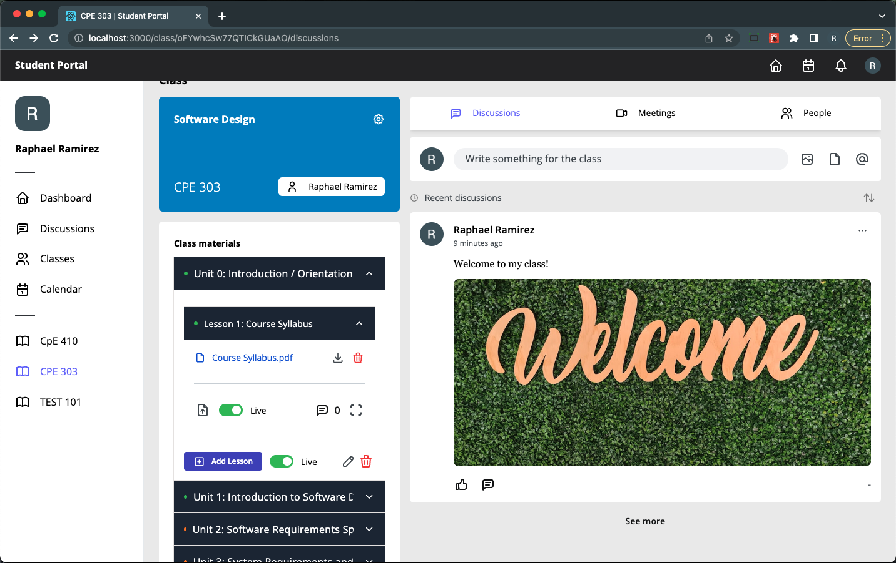
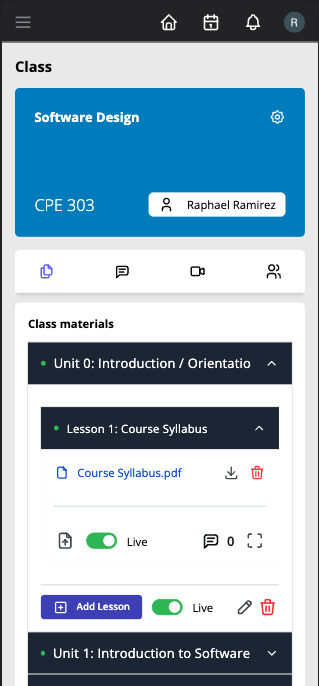

# Student Portal

A concept web-based student portal application to aid teachers and students with online learning. This project was created with the help of React Boilerplate CRA - it is a template filled with battle-tested techniques and tools that guides developers into creating cutting-edge web apps.

#### What is React Boilerplate CRA Template?
https://cansahin.gitbook.io/react-boilerplate-cra-template/

### Technologies:
Project is created with:
- React 
- TypeScript
- Mantine UI
- TailwindCSS
- Cloud Firestore
- Auth0
- Redux
- and a lot more

# Project Status
The project is still not fully complete, but major functionalities are working.

# URL
This project utilizes GitHub Actions connected to Azure Static Web Apps
You can access the page using the url: https://thankful-hill-0fb16e900.1.azurestaticapps.net/

# Setup
#### Clone the repository
```ssh
$ git clone https://github.com/ramirezraph/react-portal.git
```
#### To try out the project, you just run it like a typical react application.

```ssh
$ cd react-portal
$ yarn
$ yarn start
```

# Screenshots
The following images show what it looks like on a PC, but the app is also mobile-friendly!

### Landing Page


### Login (Auth0 Auth Flow)


### Dashboard Page


### Classes Page


### Class Page


#### On mobile


#### Write Post


#### Lesson

